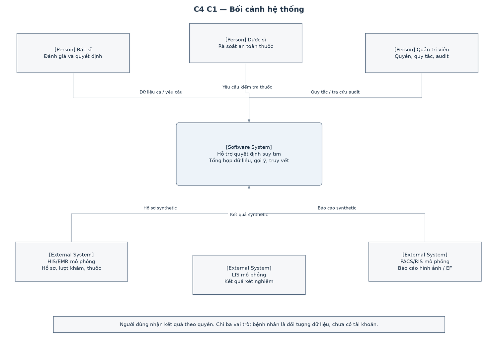
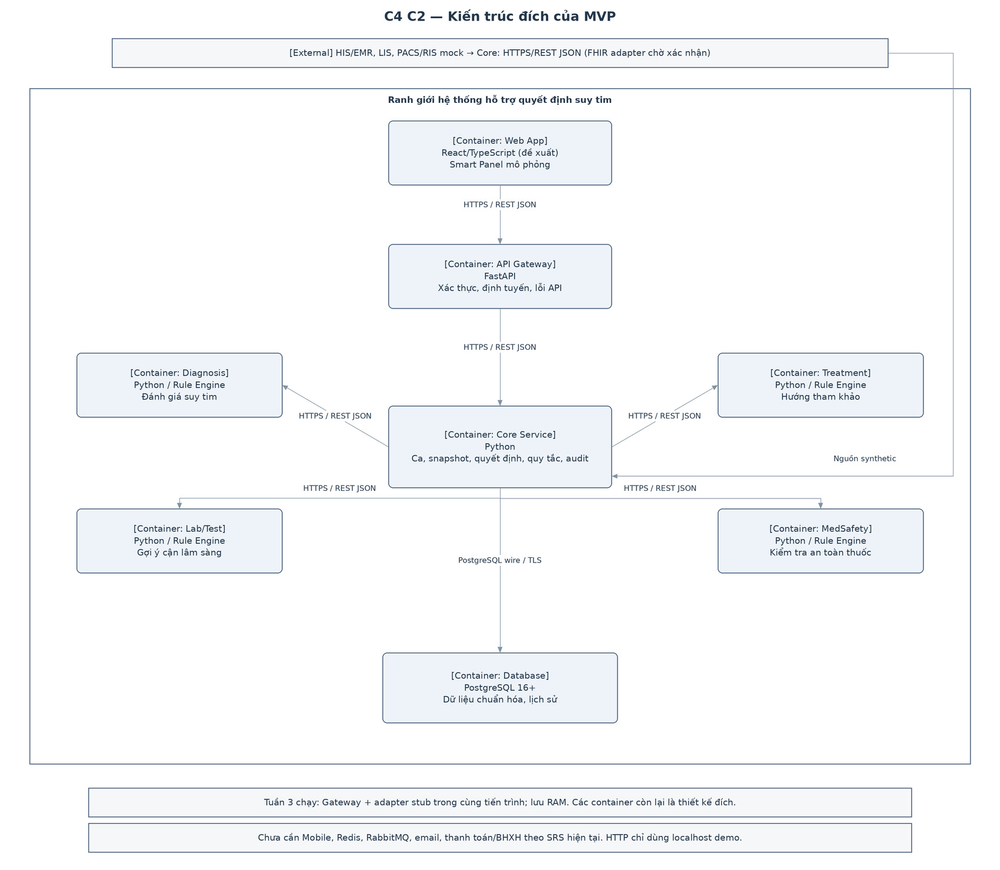

# Thiết kế kiến trúc — tuần 3

Mốc yêu cầu: SRS trên nhánh `submit/suy_tim-nhom27`, blob `7d3a0557f962e33a1c4b12fd865e638effb80977`. Ba vai trò: bác sĩ, dược sĩ, quản trị.

Thư mục này chứa PNG và nguồn `.drawio` cùng tên cho C4, DFD, ERD, Class và Sequence. [Sơ đồ tuần 2 và mô tả DFD](../SRS_v1.0.md#9-dfd) · [ERD và từ điển dữ liệu](../../database/erd.md) · [UML tuần 3](../uml/uml.md). Tệp [So_do_tuan3.drawio](So_do_tuan3.drawio) gồm 11 trang để chỉnh sửa cả bộ tuần 3.

## 1. C1 — Ranh giới và đối tượng tương tác

Bác sĩ nhập/xem ca, yêu cầu đánh giá, quyết định và xem lịch sử. Dược sĩ rà soát thuốc; không xác nhận thay bác sĩ. Quản trị quản lý cấu hình, phiên bản quy tắc và audit; quyền quản trị kỹ thuật không mặc định cho phép duyệt chuyên môn. Bệnh nhân là đối tượng được hỗ trợ gián tiếp, chưa phải actor đăng nhập.

HIS/EMR, LIS và PACS/RIS là nguồn ngoài dự kiến. Tuần 3 mô phỏng bằng dữ liệu nhập/API, chưa kết nối bệnh viện. Tài liệu nguồn phân loại nơi nhập dữ liệu ở mức đề xuất; không coi đây là xác nhận tích hợp. Các đường nối trên C1 biểu diễn quan hệ sử dụng/cung cấp dữ liệu; kết quả được trả về người yêu cầu theo quyền.

## 2. C2 — Các container và giao tiếp

| Container | Trách nhiệm | Giao tiếp |
|---|---|---|
| Web App | Smart Panel mô phỏng, nhập/xem dữ liệu và quyết định | HTTPS/REST JSON → Gateway |
| API Gateway | Xác thực, kiểm quyền đầu vào, routing, chuẩn hóa lỗi | HTTPS/REST JSON → Core |
| Core Service | Ca/lượt khám, snapshot, điều phối module, lịch sử, quyết định, rule và audit | HTTPS/REST tới bốn dịch vụ; PostgreSQL wire/TLS tới DB |
| Diagnosis | Đánh giá suy tim dựa trên căn cứ đã duyệt | Nhận snapshot, trả kết quả/căn cứ |
| Lab/Test | Gợi ý CLS còn thiếu, ưu tiên, tránh trùng | Nhận snapshot/kết quả liên quan |
| Treatment | Hướng điều trị tham khảo | Không tự ban hành y lệnh |
| MedSafety | Kiểm tra thuốc và dữ liệu an toàn | Trả cảnh báo và phần chưa kiểm tra được |
| PostgreSQL | Dữ liệu chuẩn hóa và truy vết bất biến | Core là đầu mối ghi; module không sửa hồ sơ trực tiếp |

Đây là kiến trúc đích đề xuất. Không đồng nhất “container C4” với một Docker container: đó là ứng dụng/dịch vụ/kho dữ liệu có thể triển khai riêng. Chia bốn dịch vụ để phù hợp bốn module và có khả năng triển khai riêng; cần cân nhắc chi phí vận hành khi triển khai thật.

Bản chạy tuần 3 có **một Gateway FastAPI**, bộ nhớ RAM và bốn adapter StubModule chạy trong tiến trình. Core handler đang gộp trong skeleton; các đường mạng Core ↔ module chưa được triển khai. `services.py` là điểm thay adapter stub bằng HTTP client khi tách dịch vụ. PostgreSQL đã có DDL và Compose profile riêng, nhưng Gateway chưa dùng DB đó.

## 3. Quyết định kiến trúc

| Quyết định | Lý do / giới hạn |
|---|---|
| Python/FastAPI | Có validation, Swagger UI và dễ tạo stub; lựa chọn kỹ thuật của nhóm |
| PostgreSQL 16+ | Quan hệ ca–lượt khám–đánh giá cần PK/FK, CHECK và transaction |
| Đồng bộ REST trước | Đủ luồng demo; tránh thêm broker khi chưa có tác vụ bất đồng bộ được yêu cầu |
| Chưa dùng Redis/RabbitMQ | Chưa có chứng cứ nhu cầu cache/queue trong SRS; ghi nhận là hướng mở rộng |
| Chưa có Mobile/Email/BHXH/Payment | Những thành phần này nằm trong ví dụ của đề bài nhưng không có FR tương ứng trong SRS hiện tại; xác nhận nếu thầy yêu cầu mọi nhóm phải có |
| Snapshot bất biến | Dữ liệu mới không được làm thay đổi căn cứ của đánh giá cũ |
| Quyết định + audit cùng transaction | Tránh đã lưu quyết định nhưng mất dấu truy vết |
| Người dùng có nhiều vai trò | Dùng bảng user_role; không ép kế thừa người dùng theo nghề nghiệp |

## 4. Quyền trong stub

| Thao tác | Bác sĩ | Dược sĩ | Quản trị |
|---|---|---|---|
| Tạo/sửa ca, nhập CLS/thuốc | Có | Không | Không |
| Xem ca và lịch sử đầy đủ | Có | Không | Không |
| Xem thuốc, gọi MedSafety | Có | Có | Không |
| Gọi Diagnosis/Lab/Test/Treatment | Có | Không | Không |
| Ghi quyết định | Có | Không | Không |
| Tạo/test rule, xem audit | Không | Không | Có |
| Tự phê duyệt lâm sàng | Không triển khai | Không triển khai | Không triển khai |

Demo có một tài khoản cho mỗi vai trò; dược sĩ được rà thuốc của mọi ca synthetic trong phiên. Đây là giả định demo, không phải phân quyền bệnh viện. Thiết kế DB có case_access và user_role để triển khai quyền theo ca và đa vai trò sau này. API quản lý tài khoản chi tiết chờ bổ sung UC tương ứng; skeleton dùng tài khoản cố định.

## 5. Nguồn kỹ thuật

- C4 Container: https://c4model.com/diagrams/container
- FastAPI APIRouter / cấu trúc nhiều file: https://fastapi.tiangolo.com/tutorial/bigger-applications/
- OpenAPI 3.0.3: https://spec.openapis.org/oas/v3.0.3.html

